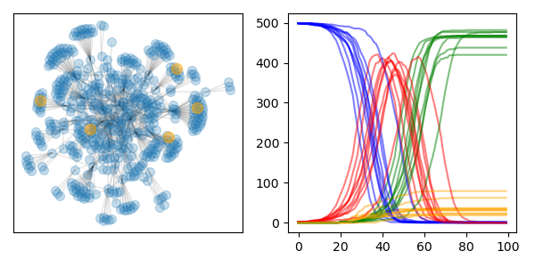
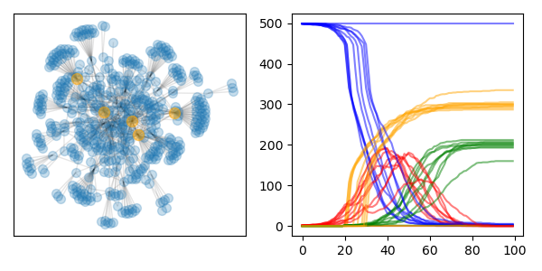

# cs618-final-project

# random immunization

# highest-degree immunization

# Some kind of epidemic simulator
- Description
    - Graph `G` that consists of nodes `N`
        - Graphs generated with https://networkx.org/documentation/stable/reference/generators.html
    - Set of agents `A`
        - Possible actions
            - Move - move to an adjacent node
            - Stay - stay at the current node
            - Return - return to the previous node
                - Or return to starting node? This makes sense: agent will travel around, then go back to where they started (home?)
    - Interaction model
        - At every timestep `t`:
            - Every agent performs `1` action
    - Transmission model
        - Get set of nodes that contain infected agents
        - If node also contains susceptible agents:
          - Let `tp` be the probability of transmission
          - Let `ni` be the number of infected agents at the node
          - Susceptible agents have a `tp * ni` probability of infection
    - Immunization models
        - Random
            - `n` nodes every timestep?
            - `n` nodes all at once?
        - Immunize node(s) with highest degree
            - All at once?
            - `n` of them every timestep?
        - Immunize most frequently traveled nodes
            - Calculate frequency every timestep
            - `n` of them every timestep?
        - When to immunize?
            - After certain percentage of population infected?
            - After certain number of timesteps?
        - Should vaccines be a limited resource?
    - Other
        - Can try to enforce "social distancing" by lowering agent travel probability during epidemic?
        - Can have a percentage of population ignore this
        - Can have a percentage of population be "anti-vax"

# What to look at?
- social distancing
    - show effects of social distancing with percentage of population participating
    - compare graphs
    - find where social distancing breaks down when enough agents do not participate
- immunization
    - show effects of immunization with different strategies
    - compare graphs
    - random strategy
    - highest degree node strategy
    - most frequently traveled strategy
    - find where immunization breaks down when enough agents do not participate?
